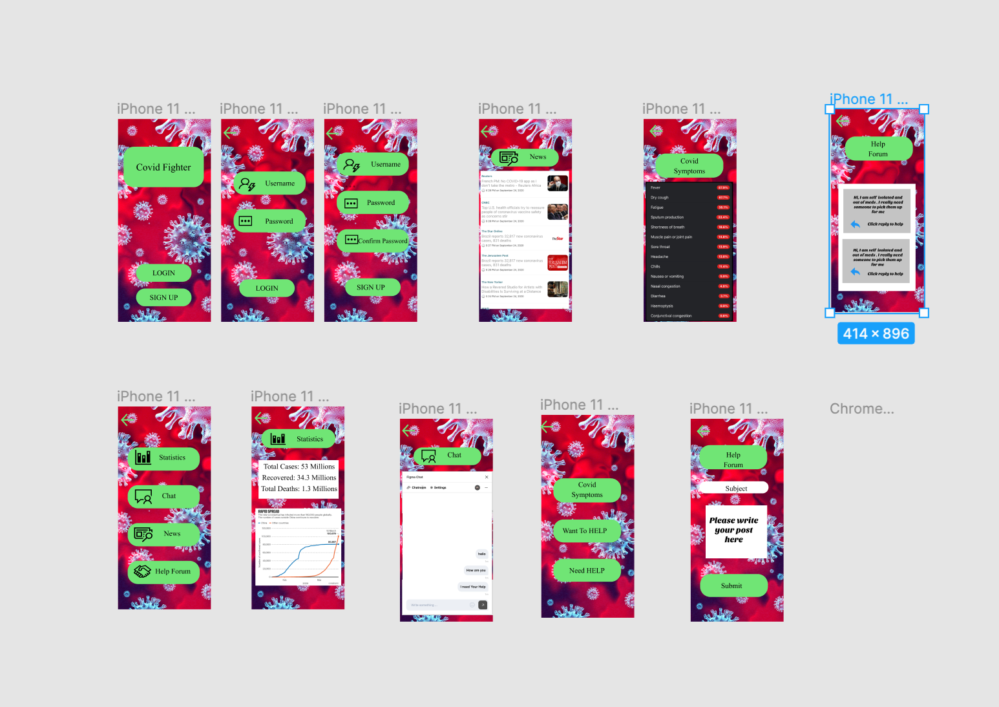

# COVID-Fighter
This application is specifically designed for helping people in the difficult times of Coronavirus. This app is very informative as it not only gives the updated statistics of the world as well as it also gives you all the news related to it with just a single tap. This app also offers a help-forum which enables help-seekers to find help easily as well as the volunteers a platform that they can use to find people who are in need of help. This help also has a chat messaging system where people can ask questions to others as well as answer them.

[ProtoType LINK](https://www.figma.com/proto/cjWYCbq7H6VTnCEgYV9hMg/Covid?node-id=1%3A2&viewport=600%2C415%2C0.7577173709869385&scaling=scale-down)

Features:
Login
Signup
Covid Statistics
Create Posts
Reply To posts
Messaging
Checking Symptoms
News related to Coronavirus

# Prototype Images
 

# future Goals

<table>
  <tr>
    <th>Problems </th>
    <th>Solutions</th>
  </tr>
  <tr>
    <td>1. notify you if You are standing near to a corona positive guy</td>
    <td> 1. using the bluetooth trechnlogy of phone it can be determined if a positive  person is standing real close</td>
  </tr>
    <tr>
    <td>2. Giving only verified information</td>
    <td>2.Using the help of government agencies to collecet information dierectly from them</td>
  </tr>
    <tr>
    <td>3. Stopping false information on help forums </td>
    <td>3. Under observation the activities in the help forum as well as filtering the forum to avoid abusive or disrespectful conversations</td>
  </tr>
    <tr>
    <td>4. What to do in  case of emergency</td>
    <td>4.A list of instructions to follow in case of an emergency like breathing problems or attacks to counter it till the health officials arrive</td>
  </tr>
    <tr>
    <td>5. Alerts , Complaints or quries answers </td>
    <td>5. Live agent to answer questions of the customer or any help regarding the app use as well as registering complaints against other users.</td>
  </tr>
  
  
</table>
  
# Demo Video 
[VideoLink](https://youtu.be/wtQcv6ZEFp4)  

#Prototype LINK
[ProtoType LINK](https://www.figma.com/proto/cjWYCbq7H6VTnCEgYV9hMg/Covid?node-id=1%3A2&viewport=600%2C415%2C0.7577173709869385&scaling=scale-down)

# Git hub link
[GITHUBLINK](https://github.com/VivekGupta1999/COVID-Fighter.git)

